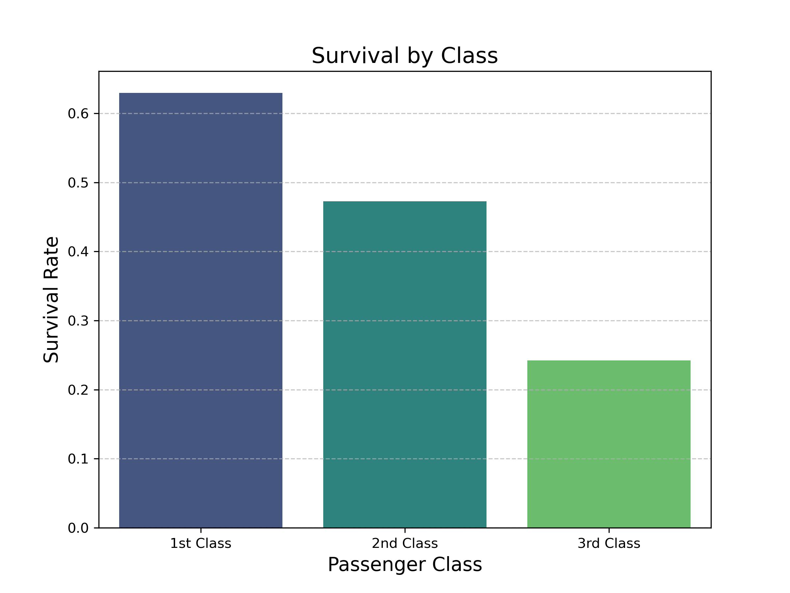
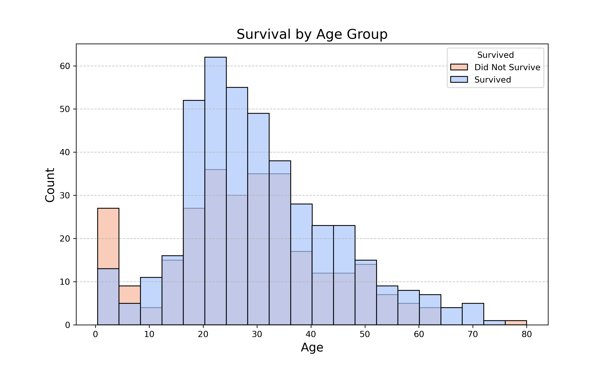

# Titanic Survival Prediction & Binary Classification Engine

[](https://www.python.org/)
[](https://scikit-learn.org/)
[](https://opensource.org/licenses/MIT)

> **Executive Summary:** An end-to-end Machine Learning classification project analyzing passenger demographic and logistical data from the RMS Titanic to predict survival probabilities. Features automated data imputation, custom domain feature engineering, cross-validation, hyperparameter tuning, and a benchmark comparison across 8 classification algorithms achieving an optimal model accuracy of **84.36%** and an **ROC AUC of 0.84**.

---

## 📊 Exploratory Data Analysis & Key Insights

Exploratory Data Analysis (EDA) revealed significant survival correlations based on passenger class, age demographics, and family dynamics:

| Survival by Passenger Class | Survival Distribution by Age Group |
| :---: | :---: |
|  |  |
| *1st Class passengers exhibited over 60% survival rate vs. ~24% for 3rd Class.* | *Children (<18) had significantly higher survival rates due to "women & children first" protocol.* |

---

## 💻 Tech Stack & Tooling

*   **Language:** Python 3.11
*   **Data Processing & Analytics:** Pandas, NumPy
*   **Machine Learning Framework:** Scikit-Learn
*   **Visualization:** Matplotlib, Seaborn
*   **Development Environment:** Spyder / Anaconda / Google Colab

---

## 🧠 Computer Science & Machine Learning Concepts Applied

This project demonstrates advanced supervised machine learning principles and software engineering practices:

*   **Robust Data Preprocessing:** Automated handling of missing data using median imputation for numeric attributes (`Age`, `Fare`) and mode imputation for categorical features (`Embarked`).
*   **Feature Engineering & Extraction:** 
    *   Extracted socio-economic titles (`Mr`, `Mrs`, `Miss`, `Master`) from passenger names via Regular Expressions.
    *   Engineered `FamilySize` (`SibSp` + `Parch` + 1) and tracked family survival probabilities through ticket and surname linkage (`Family_Survival`).
*   **Feature Scaling & Categorical Encoding:** Applied `StandardScaler` to numerical attributes and `OneHotEncoder` / `LabelEncoder` to categorical vectors.
*   **Ensemble Learning & Model Selection:** Evaluated and benchmarked 8 distinct classifiers (Random Forest, Logistic Regression, Gaussian Naïve Bayes, SVM, Decision Trees, KNN, Perceptron, SGD).
*   **Validation & Optimization:** Employing 5-Fold Cross-Validation to evaluate model stability ($\mu = 80.93\%, \sigma = 0.0488$) and utilized `GridSearchCV` for fine-tuning Random Forest hyperparameters.

---

## 📈 Model Performance Benchmark

All 8 algorithms were trained and evaluated under standardized train-test splits:

| Algorithm | Model Type | Test Accuracy | Status |
| :--- | :--- | :---: | :---: |
| **Random Forest (Refined & Selected)** | **Ensemble Tree** | **84.36%** | **Best Model** |
| Random Forest (Initial Baseline) | Ensemble Tree | 82.12% | Baseline |
| Logistic Regression | Linear Model | 80.45% | Strong Baseline |
| Gaussian Naïve Bayes | Probabilistic | 78.21% | Evaluated |
| Linear Support Vector Machine (SVM) | Kernel/Margin | 77.65% | Evaluated |
| Decision Tree | Single Tree | 75.42% | Evaluated |
| K-Nearest Neighbors (KNN) | Distance-Based | 65.92% | Evaluated |
| Perceptron | Neural / Linear | 62.01% | Evaluated |
| Stochastic Gradient Descent (SGD) | Optimization | 59.22% | Evaluated |

### Optimal Model Diagnostic Metrics (Tuned Random Forest)

*   **Precision:** 80.60% *(High confidence in positive survival predictions)*
*   **Recall:** 72.97% *(Effective identification of actual survivors)*
*   **F1-Score:** 77.46% *(Harmonic mean demonstrating balanced classification)*
*   **ROC AUC Score:** 0.84 *(Strong discrimination capability between classes)*

---

## 🚀 Getting Started

### Prerequisites

*   Python 3.10+
*   pip package manager

### Installation

1. **Clone the repository:**
   ```bash
   git clone [https://github.com/](https://github.com/)[YOUR_GITHUB]/titanic-survival-prediction.git
   cd titanic-survival-prediction
```

```